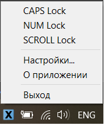
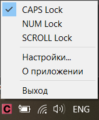
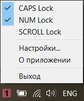
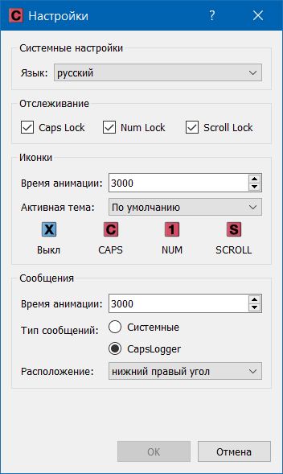

# CapsLoggerV2
Современный индикатор состояния Caps/Num/Scroll Lock на C++17 и Qt. Переосмысление ассемблерной версии — кроссплатформенная, с настраиваемым интерфейсом и анимацией.  

  
*Скриншоты интерфейса программы в трее и контекстного меню (все выключены/включен Caps Lock/включены Caps/Num Lock)*  

  
*Скриншот окна настроек*  

## ✨ Особенности
- **Кроссплатформенность**: Windows (WinAPI), Linux (X11/Wayland)
- **Гибкая темизация**: сторонние наборы иконок без пересборки
- **Анимация**: плавное «дыхание» иконок при множественных состояниях (время анимации настраивается)
- **Умные уведомления**: кастомные popup-сообщения с настраиваемым позиционированием, с возможностью переключится на системные (время отображения настраивается)
- **Точечное отслеживание**: отслеживание каждой из 3 клавиш можно отключить через настройки
- **Программное нажатие**: включение Caps/Num/Scroll Lock через контекстное меню
- **Мультиязычность**: русский/английский (требует пересборки после добавления вашего нового `.ts`)
- **Безопасность**: предотвращение повторного запуска, определение возможности отслеживая состояния при запуске, отказоустойчивость к отсутствию иконок настроенной темы
- **Качество кода**: проверено через IWYU, Valgrind и AddressSanitizer

### ⚠️ Ограничения Wayland
- Невозможно программно включать/выключать клавиши через контекстное меню (нет API)
- Кастомные уведомления фиксированы на экране (обычно в правом верхнем углу)
- Рекомендуется использовать системные уведомления


## 📁 Структура репозитория
```
CapsLoggerV2/
├── docs/              # Скриншоты интерфейса
│   └── THEMES/        # Примеры доп. тем (без пересборки)
├── sources/
│   ├── main.cpp       # Точка входа
│   ├── platform/      # Платформенно-зависимая реализация
│   └── gui/           # Qt-интерфейс и настройки
├── translations/      # Файлы переводов .ts
├── resources/         # Иконки в формате .png
├── resources.qrc      # Коллекция ресурсов Qt
├── CMakeLists.txt     # Cmake конфигурация сборки
├── README.md
└── LICENSE
```

## ⚙️ Сборка

### Требования
- Компилятор с поддержкой C++17
- Qt ≥ 5.9
- CMake ≥ 3.16
- Ninja build (рекомендуется)


### Флаги сборки
| Флаг                       | Пояснение                                                                                                                                                                                 |
|----------------------------|-------------------------------------------------------------------------------------------------------------------------------------------------------------------------------------------|
| -DQT_VERSION               | версия Qt (5 либо 6, по умолч. ищет старшую версию)                                                                                                                                       |
| -DIWYU_PATH                | путь к утилите iwyu ("" - пустая строка в случае когда её вывод не требуется,<br>по умолч. ищет в PATH)                                                                                   |
| -DSTATIC_RUNTIME           | включение статической сборки (ON или OFF, по умолч. выключена)                                                                                                                            |
| -DCMAKE_PREFIX_PATH        | Путь к директории установки Qt (напр., у вас есть разные версии<br>для динамической сборки x64 "C:\Qt\5.15.2\msvc2022_64"<br>и для статической x86 "C:\Qt\5.15.2\msvc2022_32_release_mt") |
| -DCMAKE_BUILD_TYPE=Release | оптимизация сборки и наличие отладочных символов                                                                                                                                          |


### Пример сборки на Windows (MSVC 2022 + Qt 5)
```powershell
# Переместиться в директорию локально клонированного репозитория
cd C:\path\to\CapsLoggerV2\repo

# Активировать среду сборки в разной разрядности (x64/x86) - путь зависит от версии
"C:\Program Files\Microsoft Visual Studio\2022\Community\VC\Auxiliary\Build\vcvarsall.bat" x64

# Сгенерировать все требуемые .ts → .qm
lrelease translations/CapsLoggerV2_ru.ts translations/CapsLoggerV2_en.ts

cmake -S . -B build -G Ninja -DCMAKE_BUILD_TYPE=Release -DQT_VERSION=5 -DIWYU_PATH="" -DCMAKE_PREFIX_PATH=C:\Qt\5.15.2\msvc2022_64
cmake --build build
```

Для создания портативной версии Windows также можно использовать
```powershell
windeployqt build/CapsLoggerV2.exe
```


### Linux (Qt5/Qt6)
```bash
# Минимальные зависимости для сборки на Linux (Debian/Ubuntu)
sudo apt install build-essential cmake ninja-build qtbase5-dev qtbase5-dev-tools qttools5-dev-tools libqt5x11extras5-dev libxtst-dev libxkbfile-dev

# Qt6 если требуется
sudo apt install qt6-base-dev qt6-base-dev-tools qt6-tools-dev-tools

# В некоторых случаях может потребоваться установка пакета
```
```bash
# Переместиться в директорию локально клонированного репозитория
cd \path\to\CapsLoggerV2\repo

# Сгенерировать все требуемые .ts → .qm
lrelease translations/CapsLoggerV2_ru.ts translations/CapsLoggerV2_en.ts

# Qt5
cmake -S . -B build-qt5 -G Ninja -DCMAKE_BUILD_TYPE=Release -DQT_VERSION=5 -DIWYU_PATH=""
cmake --build build-qt5

# Qt6
cmake -S . -B build-qt6 -G Ninja -DCMAKE_BUILD_TYPE=Release -DQT_VERSION=6 -DIWYU_PATH=""
cmake --build build-qt6
```

## 🧪 Протестированные конфигурации сборки

| Платформа                                        | Среда                                    | Qt                                           | Прочий софт                         |
|--------------------------------------------------|------------------------------------------|----------------------------------------------|-------------------------------------|
| Windows 10 x64                                   | MSVC 2022,<br>Clang 21.1.8,<br>MinGW 5.3 | 5.9.0 - 5.15.2 (x64 dynamic /<br>x32 static) | CMake 3.29.2,<br>Ninja build 1.12.0 |
| Ubuntu 24.04<br>(также с MATE/<br>KDE/LXQt/Xfce) | GCC 13.3.0,<br>Clang 18.1.3              | 5.15.3 / 6.4.2                               | CMake 3.28.3,<br>Ninja build 1.11.1 |
| Manjaro KDE<br>26.0.2                            | GCC 15.2.1                               | 5.15.18 / 6.10.2                             | CMake 4.2.3,<br>Ninja build 1.13.2  |

Бинарник сборки со статическими библиотеками разрядностью x32 успешно протестирована на Windows 7 x32
Дополнительно сборка и запуск были проверены на Linux Mint 22.3 Cinnamon/MATE/Xfce, Lubuntu 24.04.4, AlmaLinux 10.1, Astra Linux 1.6

## 🌐 Дополнительные переводы
1. Указать qm-файл с переводом в "resources.qrc" по аналогии с translations/CapsLoggerV2_en.qm
2. Занести язык перевода в 'enum CapsLoggerLanguage' в "sources/gui/SettingsDefines.h"
3. Добавить обработку нового значения enum в функции 'languageName' и 'setAppLanguage' в "sources/gui/SettingsDefines.cpp"
4. Запустить обновление файлов переводов, чтобы подхватились новые tr-строки и создать новый .ts-файл:
```bash
lupdate sources/ -ts translations/CapsLoggerV2_XX.ts
```
5. Перевести вручную строки в Qt Linguist. Для быстрого открытия (указать путь к вашему файлу):
```bash
linguist translations/CapsLoggerV2_XX.ts
```
6. Скомпилировать ваш `.ts` → `.qm`:
```bash
lrelease translations/CapsLoggerV2_XX.ts
```
7. Собрать приложение

## 🎨 Создание кастомной темы

### Быстрый старт
1. Скопируйте папку `THEMES/` из папки репозитория 'docs/' рядом с исполняемым файлом
2. Откройте настройки приложения → раздел "Иконки" пункт "Активная тема"
3. Выберите любую из предлагаемых тем для примера

### Создание своей темы
1. В папке `THEMES/` создайте новую директорию с уникальным названием (например, `my-theme`)
2. Использовав содержимое любой существующей темы как шаблон **структуры и имен `.png` файлов** сформируйте свой пакет иконок

### Важно
- Если какая-либо иконка отсутствует, приложение автоматически переключится на встроенную тему
- После добавления новой темы достаточно открыть окно настроек и она отобразится в списке без перезапуска приложения
- Для предпросмотра темы просто выберите ваш пакет иконок из выпадающего списка "Активная тема" в настройках

## 🔧 Устранение проблем с иконкой в системном трее (GNOME)

Если после запуска приложения иконка не появляется в области уведомлений (трее), но сами уведомления приходят — это связано с тем, что современные версии GNOME больше не поддерживают устаревший протокол **XEmbed**, используемый некоторыми приложениями или старыми версиями Qt. Вместо него используется стандарт **StatusNotifierItem (SNI)**.

### ✅ Решение

Установите и активируйте расширение **AppIndicator and KStatusNotifierItem Support**, которое обеспечивает обратную совместимость.

#### 1. Установка расширения
```bash
# В дистрибутивах на основе Debian / Ubuntu:
sudo apt install gnome-shell-extension-appindicator
```
#### 2. Активация расширения
```bash
gnome-extensions enable appindicatorsupport@rgcjonas.gmail.com
```

#### 3. Перезапуск оболочки GNOME


## 📄 Лицензия
Код проекта распространяется под лицензией **MIT**  — см. файл [LICENSE](LICENSE)  
Проект использует фреймворк [Qt](https://www.qt.io/) под лицензией LGPLv3.